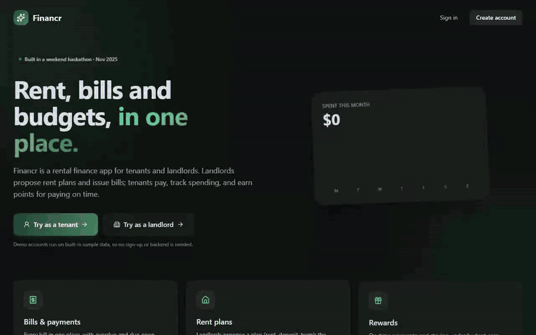
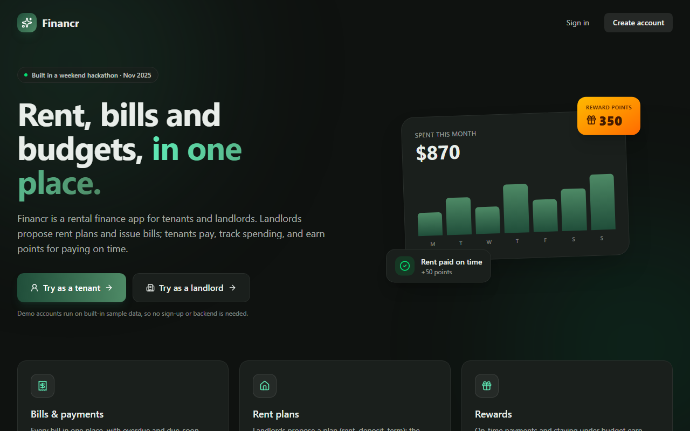
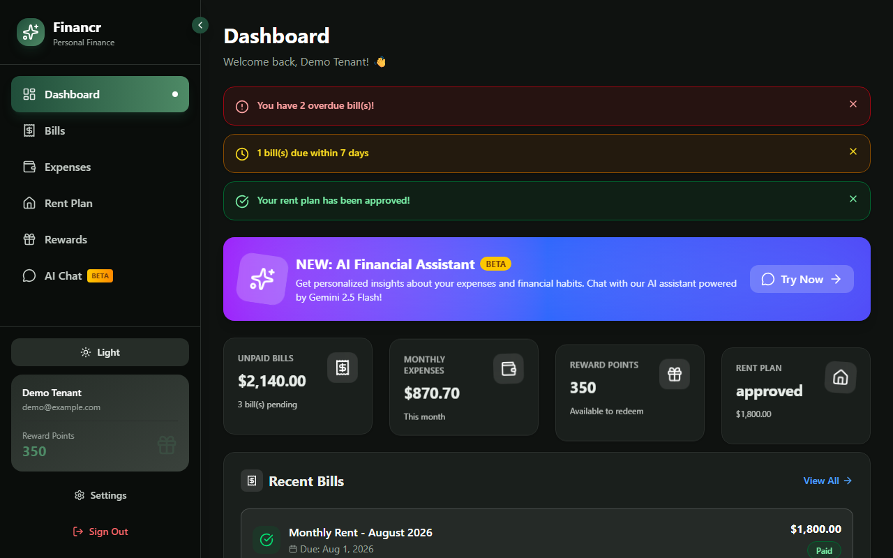
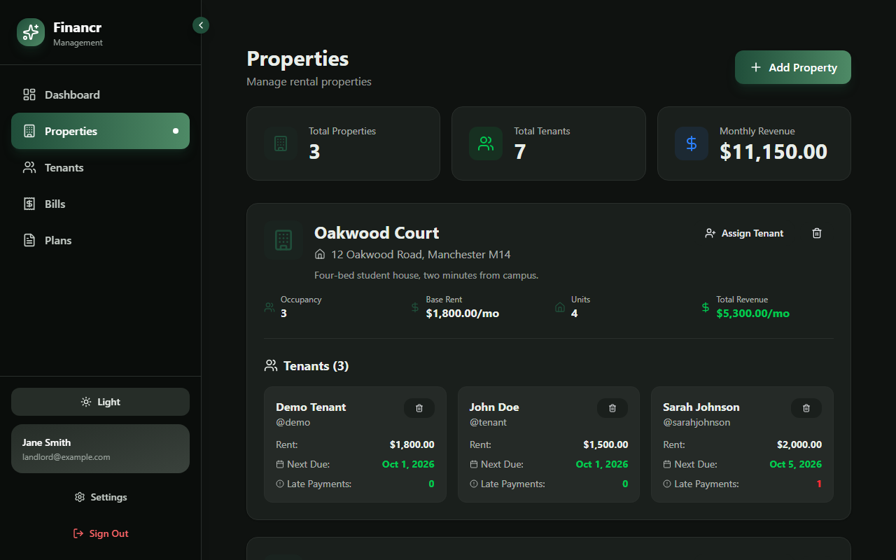
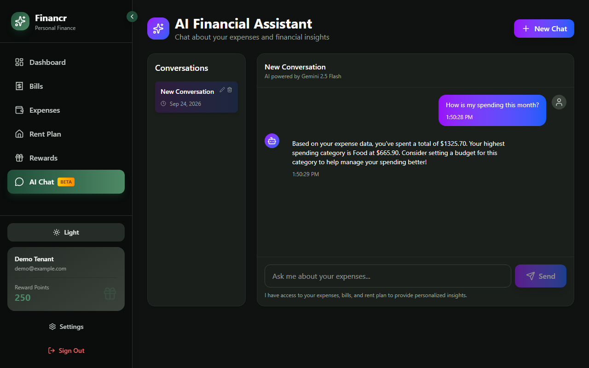
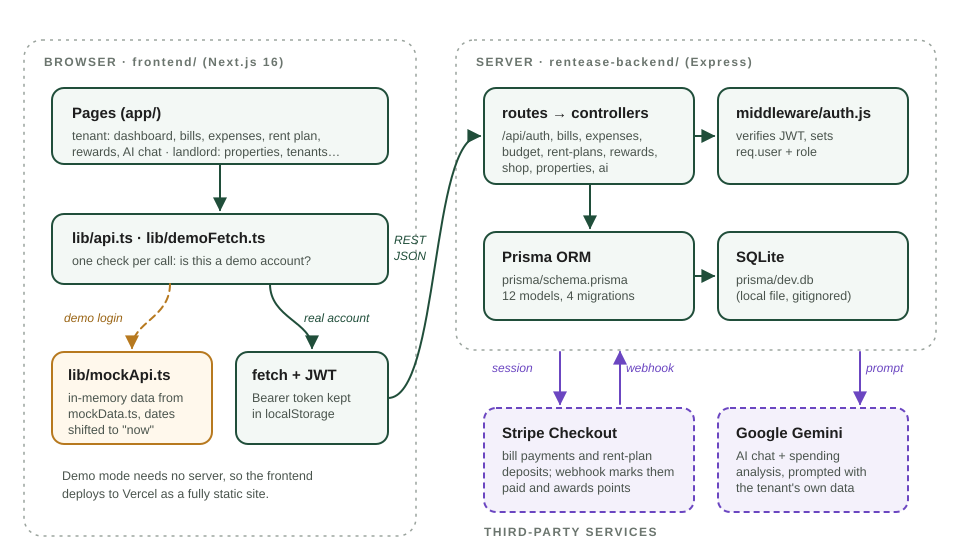
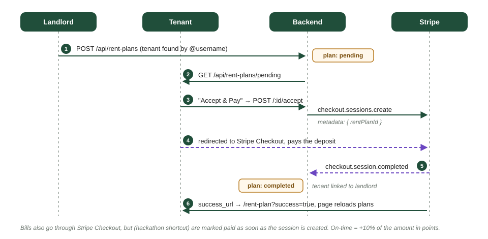

# Financr (housr)

A rental finance app for tenants and landlords: rent plans, bills, budgets, a points-based rewards shop and an AI assistant that reads your own spending. Built in a weekend hackathon in November 2025.



The demo above runs entirely in the browser: the "Try as a tenant / Try as a landlord" buttons log into built-in demo accounts backed by sample data, so you can click through everything without a backend. ([MP4 version](docs/media/demo.mp4))

## The hackathon

- **When:** the weekend of 8 and 9 November 2025. The first commit landed on the Saturday evening and the last on Sunday morning, about 12 hours later. The event's name isn't recorded anywhere in the repo.
- **Team** (from the git history):
  - [@duc-minh-droid](https://github.com/duc-minh-droid) (Thomas): repo setup, the first Next.js + Express scaffold, merges.
  - [@moelnahhas](https://github.com/moelnahhas) (Mohamed Elnahhas): most of the features, including expense analytics, the budget pie chart, the rent-plan workflow, Stripe, the Gemini chat, properties, settings and the Financr rebrand.
- The project started out as "RentEase". It was renamed Financr halfway through, which is why the backend folder is still called `rentease-backend/`.

## What it does

| Tenant | Landlord |
| --- | --- |
| Dashboard with overdue and due-soon alerts | Dashboard: tenants, money received, pending plans |
| Bills: pay through Stripe Checkout; on-time payment earns points | Create bills for any tenant |
| Expenses by category, a spending chart, and a monthly budget you split with a draggable pie chart | Properties: units, occupancy, revenue, assign or remove tenants |
| Rent plan: accept a landlord's proposal by paying the deposit | Rent plans: propose rent, deposit and term to a tenant found by `@username` |
| Rewards shop: spend points on vouchers | Tenants: payment history, outstanding balance, late payments |
| AI chat (Gemini) that answers using your own bills and expenses | |

| | |
| --- | --- |
|  |  |
|  |  |

## How it works



- **Frontend** (`frontend/`): Next.js 16 App Router, React 19, Tailwind 4 and Framer Motion. Every page is a client component. All data goes through `lib/api.ts`, which checks the logged-in email on each call. A demo account gets answers from `lib/mockApi.ts` (in-memory data from `lib/mockData.ts`). Any other account gets `fetch` calls to the backend with a JWT. The few screens that used raw `fetch` (properties, settings, rent-plan offers) now go through `lib/demoFetch.ts`, which makes the same switch.
- **Backend** (`rentease-backend/`): Express with Prisma on SQLite. Auth is bcrypt plus JWT, and `middleware/auth.js` attaches `req.user` and checks the role. Controllers cover auth, bills, expenses, budgets, rent plans, rewards, the shop, properties, profiles and AI.
- **AI**: `aiController.js` builds a prompt from the tenant's expenses, bills and rent plan, then sends it to Gemini (`GEMINI_MODEL`, default `gemini-2.5-flash`). In demo mode, replies come from keyword-matched templates that use the demo data.

### Rent plans and payments



The team reversed the rent-plan flow partway through the weekend. The landlord now proposes a plan, and the tenant accepts it by paying the deposit through Stripe Checkout. The Stripe webhook (`POST /api/rent-plans/stripe/webhook`) marks the plan `completed` and links the tenant to the landlord. If `STRIPE_WEBHOOK_SECRET` isn't set, the webhook skips signature verification so it can be tested locally. After the redirect, the frontend reloads the plans a second later to give the webhook time to land.

Bills are simpler, and cut a corner: `POST /api/bills/:id/pay` creates a Checkout session and marks the bill paid straight away. The team did this during the hackathon so the demo didn't depend on webhooks. An on-time payment earns 10% of the bill amount in points.

## Quick start

### Frontend only (demo mode, no backend)

```bash
cd frontend
npm install
npm run dev            # http://localhost:3000
```

Click **Try as a tenant** or **Try as a landlord**. Changes you make in demo mode (paying a bill, setting a budget, redeeming a reward) last until you refresh the page. The demo data's dates shift so that "this month" is always the current month.

### Full stack

```bash
# backend
cd rentease-backend
cp .env.example .env    # set JWT_SECRET; GEMINI_API_KEY and STRIPE_* are optional
npm install
npm run setup           # prisma migrate deploy + generate (creates prisma/dev.db)
npm run dev             # http://localhost:5001

# frontend, in another terminal
cd frontend
cp .env.example .env.local   # NEXT_PUBLIC_API_URL=http://localhost:5001
npm run dev
```

Then use **Create account** to register a tenant and a landlord. The backend starts without Stripe or Gemini keys, but the AI and payment endpoints return errors until you add them. The scripts in `rentease-backend/scripts/` read the login they use from `TENANT_EMAIL` and `TENANT_PASSWORD`.

I checked these commands on Windows with Node 24: `npm run build` in `frontend/` completes and every route prerenders as static, and the backend answers `/health` and `/api/auth/register` on SQLite.

### Deploying the frontend to Vercel

| Setting | Value |
| --- | --- |
| Root directory | `frontend` |
| Framework preset | Next.js |
| Build command | `npm run build` (default) |
| Output directory | default (`.next`) |
| Environment variables | none needed for the demo. Set `NEXT_PUBLIC_API_URL` only if you host the backend somewhere. |

## Project layout

```
frontend/
  app/                   pages: landing, login, signup, dashboard/{tenant,landlord,settings}
  components/            Sidebar, UI kit, expenses charts, rent-plan modals
  contexts/              AuthContext (JWT in localStorage), ThemeContext (dark by default)
  lib/api.ts             API client; picks mock or real per call
  lib/mockApi.ts, mockData.ts, demoFetch.ts, useDemoLogin.ts   demo mode
rentease-backend/
  prisma/                schema.prisma (SQLite) and migrations
  src/                   server.js, routes/, controllers/, models/, middleware/, config/
  scripts/               manual test scripts (Gemini, chatbot, webhook)
docs/
  media/                 demo recording, screenshots, diagrams
  notes/                 the team's working notes from the hackathon, kept as written
```

## Notes and trade-offs

- **Demo mode is in the client on purpose.** Hackathon judges (and anyone viewing a Vercel preview) can use the app without a database. The cost is that mock data and real API responses can drift apart, since nothing type-checks them against each other.
- **Tokens live in `localStorage`.** That's simple, but any XSS could read them. An httpOnly cookie would be the next step.
- **Bills are marked paid when the Checkout session is created** (see above). Moving bills onto the webhook path that rent plans already use would fix this.
- **History cleanup.** The merge commits on `main` had dropped a large part of the finished work and re-added `node_modules`. This branch restores the last complete tree, fixes the resulting type errors, and removes the committed `.env`, SQLite database and logs.

## What's next

- Move bill payment onto the Stripe webhook, and add an idempotency key on the webhook.
- Seed script for local demo data on the real backend.
- Recurring bills (monthly rent generated automatically from the active plan).
- Tests for the rent-plan state machine (`pending → completed | rejected | cancelled`).
